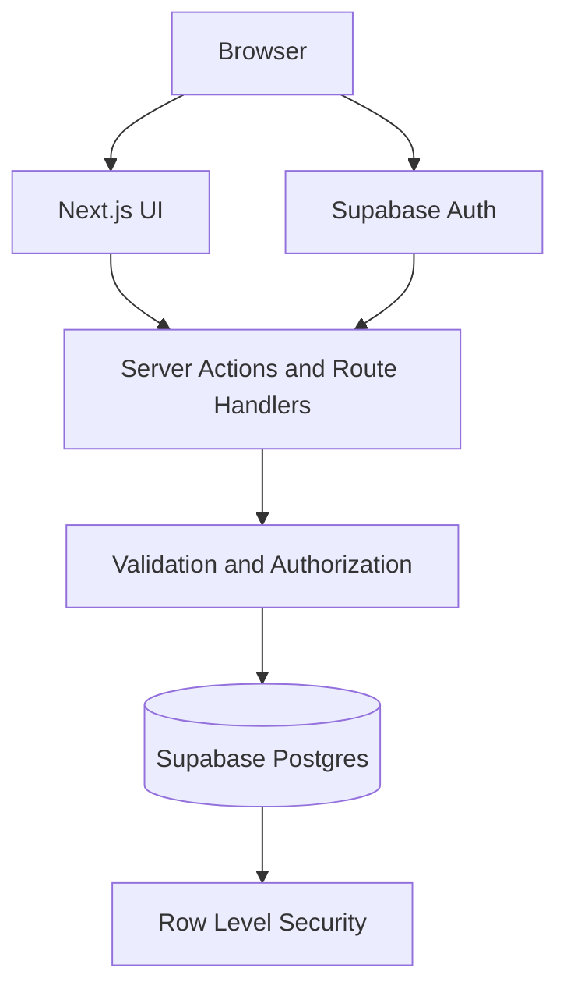
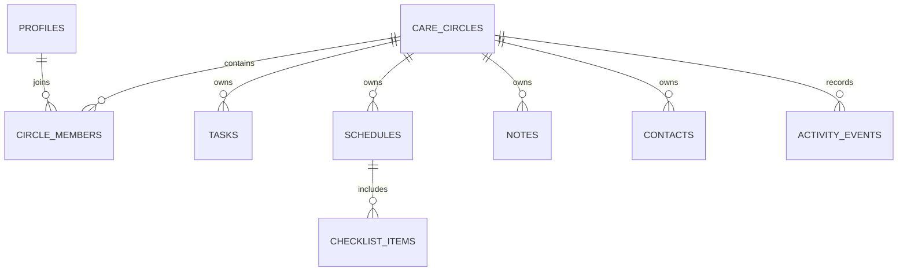

# CareCircle — Technical Architecture

## 1. Architecture Goals

The architecture should support a polished portfolio MVP that is:

- secure by default;
- responsive and accessible;
- simple enough to explain in a case study;
- realistic enough to demonstrate full-stack engineering;
- easy to seed with fictional demo data;
- maintainable without premature microservices.

Use a modular monolith. Do not introduce separate backend services, message brokers, Kubernetes, or other infrastructure that the MVP does not need.

## 2. Recommended Stack

| Layer | Choice | Reason |
| --- | --- | --- |
| Web framework | Next.js App Router + TypeScript | Full-stack routing, server rendering, and server actions in one codebase |
| Styling | Tailwind CSS | Fast, consistent responsive styling |
| UI primitives | shadcn/ui or Radix-based accessible primitives | Accessible dialogs, menus, selects, and composable components |
| Database | Supabase Postgres | Relational model fits memberships, assignments, and activity history |
| Authentication | Supabase Auth | Email authentication and session management |
| Authorization | Postgres Row Level Security plus server validation | Care Circle data isolation |
| Validation | Zod | Shared input schemas and safe parsing |
| Forms | React Hook Form or native server-action forms | Predictable validation and accessible errors |
| Icons | Lucide | Consistent icon family |
| Dates | `Intl.DateTimeFormat` with Indonesian locale | Avoid unnecessary date dependencies |
| Testing | Vitest + Testing Library + Playwright | Unit, component, and end-to-end coverage |
| Deployment | Vercel + Supabase | Simple portfolio deployment |

Use the stable versions produced by the current official project scaffolding. Do not hardcode secrets or expose the Supabase service-role key to the browser.

## 3. High-level Architecture



### Request rule

Every mutation follows this order:

1. authenticate the current user;
2. parse input with a schema;
3. verify active membership and required role;
4. perform the database mutation;
5. write a meaningful activity event when needed;
6. revalidate affected server-rendered paths;
7. return a typed success or error result.

Client-side route protection is for UX only. Database policies and server-side checks are the security boundary.

## 4. Application Modules

Organize the code by domain:

```text
src/
  app/
    (public)/
      page.tsx
    (auth)/
      sign-in/
      sign-up/
    (app)/
      onboarding/
      dashboard/
      tasks/
      schedule/
      notes/
      contacts/
      members/
      activity/
      settings/
  components/
    ui/
    layout/
    feedback/
  features/
    circles/
    members/
    tasks/
    schedules/
    notes/
    contacts/
    activities/
  lib/
    auth/
    supabase/
    validation/
    permissions/
    dates/
    errors/
  types/
supabase/
  migrations/
  seed.sql
tests/
  unit/
  integration/
  e2e/
```

Within each `features/<domain>` directory, prefer:

- `actions.ts` for mutations;
- `queries.ts` for server-side reads;
- `schemas.ts` for Zod schemas;
- `types.ts` for domain types;
- `components/` for domain-specific UI.

Do not put database calls directly inside generic visual components.

## 5. Data Model

All primary keys are UUIDs. All timestamps are UTC `timestamptz`. Display them in the user's local timezone.

### `profiles`

| Column | Type | Notes |
| --- | --- | --- |
| `id` | uuid | Primary key; references authenticated user |
| `display_name` | text | Required |
| `avatar_url` | text | Optional |
| `created_at` | timestamptz | Default now |
| `updated_at` | timestamptz | Default now |

### `care_circles`

| Column | Type | Notes |
| --- | --- | --- |
| `id` | uuid | Primary key |
| `name` | text | Required |
| `created_by` | uuid | References profile |
| `created_at` | timestamptz | Default now |
| `updated_at` | timestamptz | Default now |

### `circle_members`

| Column | Type | Notes |
| --- | --- | --- |
| `circle_id` | uuid | References care circle |
| `user_id` | uuid | References profile |
| `role` | enum | `coordinator` or `member` |
| `joined_at` | timestamptz | Default now |

Composite primary key: `circle_id`, `user_id`.

### `circle_invites`

| Column | Type | Notes |
| --- | --- | --- |
| `id` | uuid | Primary key |
| `circle_id` | uuid | References care circle |
| `code_hash` | text | Never store a reusable raw code when hashing is practical |
| `created_by` | uuid | References profile |
| `expires_at` | timestamptz | Required |
| `max_uses` | integer | Default 10 |
| `use_count` | integer | Default 0 |
| `revoked_at` | timestamptz | Optional |
| `created_at` | timestamptz | Default now |

### `tasks`

| Column | Type | Notes |
| --- | --- | --- |
| `id` | uuid | Primary key |
| `circle_id` | uuid | Required isolation key |
| `title` | text | Required, max 120 characters |
| `description` | text | Optional, max 1000 characters |
| `assigned_to` | uuid | References a member profile |
| `created_by` | uuid | References profile |
| `schedule_id` | uuid | Optional linked schedule |
| `priority` | enum | `normal` or `important` |
| `due_at` | timestamptz | Optional |
| `completed_at` | timestamptz | Null when open |
| `completed_by` | uuid | Optional profile reference |
| `created_at` | timestamptz | Default now |
| `updated_at` | timestamptz | Default now |

### `schedules`

| Column | Type | Notes |
| --- | --- | --- |
| `id` | uuid | Primary key |
| `circle_id` | uuid | Required isolation key |
| `title` | text | Required, max 120 characters |
| `description` | text | Optional |
| `location_name` | text | Optional |
| `starts_at` | timestamptz | Required |
| `ends_at` | timestamptz | Optional; must be after start |
| `companion_user_id` | uuid | Optional circle member |
| `created_by` | uuid | References profile |
| `created_at` | timestamptz | Default now |
| `updated_at` | timestamptz | Default now |

### `checklist_items`

| Column | Type | Notes |
| --- | --- | --- |
| `id` | uuid | Primary key |
| `circle_id` | uuid | Duplicated isolation key for simpler policies |
| `schedule_id` | uuid | References schedule; cascade delete |
| `label` | text | Required, max 160 characters |
| `assigned_to` | uuid | Optional member |
| `position` | integer | Stable ordering |
| `completed_at` | timestamptz | Null when open |
| `completed_by` | uuid | Optional profile reference |
| `created_at` | timestamptz | Default now |

### `notes`

| Column | Type | Notes |
| --- | --- | --- |
| `id` | uuid | Primary key |
| `circle_id` | uuid | Required isolation key |
| `body` | text | Required, max 2000 characters |
| `schedule_id` | uuid | Optional related schedule |
| `is_pinned` | boolean | Default false |
| `created_by` | uuid | References profile |
| `created_at` | timestamptz | Default now |
| `updated_at` | timestamptz | Default now |

### `contacts`

| Column | Type | Notes |
| --- | --- | --- |
| `id` | uuid | Primary key |
| `circle_id` | uuid | Required isolation key |
| `name` | text | Required |
| `role_label` | text | Required, such as `Transportasi` |
| `phone` | text | Optional |
| `address` | text | Optional |
| `note` | text | Optional |
| `created_by` | uuid | References profile |
| `created_at` | timestamptz | Default now |
| `updated_at` | timestamptz | Default now |

### `activity_events`

| Column | Type | Notes |
| --- | --- | --- |
| `id` | uuid | Primary key |
| `circle_id` | uuid | Required isolation key |
| `actor_id` | uuid | References profile |
| `event_type` | enum/text | Allowlisted event name |
| `entity_type` | enum/text | Task, schedule, note, member, contact |
| `entity_id` | uuid | Referenced record identifier |
| `summary` | text | Safe human-readable summary |
| `metadata` | jsonb | Minimal non-sensitive structured data |
| `created_at` | timestamptz | Default now; append only |

## 6. Entity Relationships



## 7. Authorization Model

Create helper functions at the database layer such as:

- `is_circle_member(circle_id, auth.uid())`;
- `is_circle_coordinator(circle_id, auth.uid())`.

Policy intent:

- authenticated users can read a circle only when they are an active member;
- members can read and create circle content;
- members can update/delete records according to defined ownership rules, while coordinators can manage all circle content;
- only coordinators can manage invites, remove members, rename a circle, or delete a circle;
- a user can update only their own profile;
- activity events are readable by members but inserted only through controlled server/database logic;
- membership checks must apply to every table, including child records;
- service-role credentials may run only in trusted server code and should be avoided unless necessary.

Add SQL tests or integration tests that prove User A cannot access Circle B by changing an identifier in a request.

## 8. Server Actions and Queries

Suggested operations:

### Circles and membership

- `createCircle(input)`
- `joinCircle(inviteCode)`
- `createInvite(circleId)`
- `revokeInvite(inviteId)`
- `removeMember(circleId, userId)`
- `leaveCircle(circleId)`
- `updateCircle(circleId, input)`

### Tasks

- `listTasks(circleId, filters)`
- `createTask(input)`
- `updateTask(taskId, input)`
- `toggleTask(taskId, completed)`
- `deleteTask(taskId)`

### Schedule and checklist

- `listSchedules(circleId, range)`
- `getSchedule(scheduleId)`
- `createSchedule(input)`
- `updateSchedule(scheduleId, input)`
- `deleteSchedule(scheduleId)`
- `addChecklistItem(scheduleId, input)`
- `toggleChecklistItem(itemId, completed)`
- `reorderChecklistItems(scheduleId, orderedIds)`

### Notes and contacts

- `listNotes(circleId)`
- `createNote(input)`
- `updateNote(noteId, input)`
- `togglePinnedNote(noteId)`
- `deleteNote(noteId)`
- `listContacts(circleId)`
- `createContact(input)`
- `updateContact(contactId, input)`
- `deleteContact(contactId)`

All action results should use a consistent typed shape:

```ts
type ActionResult<T = undefined> =
  | { ok: true; data: T }
  | { ok: false; code: string; message: string; fieldErrors?: Record<string, string[]> };
```

Do not send raw database error messages to the client.

## 9. Validation Rules

- trim all human-entered strings;
- define conservative maximum lengths;
- reject blank titles after trimming;
- ensure assigned users are members of the same circle;
- ensure linked schedules belong to the same circle;
- ensure end time is after start time;
- normalize phone strings for links while preserving a readable display value;
- allow only known roles, priorities, and event types;
- validate IDs as UUIDs;
- rate-limit invite generation and join attempts;
- expire and revoke invite codes server-side.

## 10. Page Rendering Strategy

- render authenticated data pages primarily as Server Components;
- use Client Components only for interactive forms, filters, dialogs, optimistic toggles, and calendar controls;
- load the active circle on the server;
- use route-level `loading.tsx` and `error.tsx` where appropriate;
- use Suspense boundaries for independent dashboard panels;
- keep URL search parameters for task filters and schedule range when useful;
- never cache one user's private content globally.

## 11. Demo Strategy

Provide two safe ways to review the project:

1. a seeded demo account with fictional `Keluarga Harmoni` data; or
2. a `demo` route backed by isolated read-only fixtures.

The demo must not contain real names, medical history, documents, credentials, or personal contact details. If a shared demo account is used, reset its data periodically and prevent account settings changes.

## 12. Activity Event Rules

Log only meaningful coordination changes:

- task created, assigned, reassigned, completed, or reopened;
- schedule created, updated, or cancelled;
- checklist fully completed;
- important note added or pinned;
- member joined or removed.

Do not log every field focus, page view, failed keystroke, or sensitive free-text content. A summary should say “Dimas menyelesaikan tugas ‘Konfirmasi transportasi’,” not expose hidden metadata.

## 13. Error Handling and Observability

- define user-safe error codes;
- log server errors without secrets or sensitive record content;
- show retry actions for recoverable network errors;
- use a global not-found page and authenticated error boundary;
- do not pretend a failed optimistic update succeeded;
- monitor generic performance and error counts only;
- analytics, if added, must avoid recording note bodies, contact values, circle names, or task descriptions.

## 14. Testing Strategy

### Unit tests

- validation schemas;
- date formatting and overdue logic;
- permission helpers;
- progress calculations;
- action-result mapping.

### Integration tests

- create/join circle;
- role restrictions;
- task assignee must belong to circle;
- checklist and schedule isolation;
- expired/revoked invite handling;
- row-level security across two fictional users and two circles.

### End-to-end tests

1. Sign in, create a circle, and reach the empty dashboard.
2. Invite/join a second fictional member.
3. Create a schedule with checklist items.
4. Assign and complete a task.
5. Confirm dashboard progress and activity history update.
6. Verify a member cannot open coordinator-only settings.
7. Verify the core path at a mobile viewport.

### Accessibility tests

- automated checks using axe where practical;
- keyboard-only completion of main flows;
- screen-reader labels on icon buttons and dialogs;
- focus restoration after closing overlays;
- contrast and 200% zoom checks.

## 15. Performance Targets

- responsive interaction on a mid-range mobile device;
- avoid layout shift by reserving space for async content;
- paginate or limit activity history;
- index foreign keys and common queries: `circle_id`, `assigned_to`, `due_at`, `starts_at`, and `created_at`;
- fetch only columns required by each view;
- avoid loading all historic schedules on the dashboard;
- optimize images and avatars through the framework image pipeline.

## 16. Implementation Phases

### Phase 1 — Foundation

- scaffold application and design tokens;
- configure authentication and database clients;
- create migrations, seed data, and row-level policies;
- build responsive app shell and onboarding.

### Phase 2 — Core coordination flow

- tasks;
- schedules;
- preparation checklists;
- dashboard aggregation;
- activity events.

### Phase 3 — Supporting information

- notes;
- contacts;
- members, invites, and settings;
- empty/loading/error states.

### Phase 4 — Portfolio polish

- accessibility audit;
- responsive QA;
- integration and end-to-end tests;
- realistic fictional demo data;
- screenshots, README, and case-study evidence;
- deployment configuration.

## 17. AI Agent Implementation Rules

The coding agent must:

- read `description.md`, `design.md`, and `architecture.md` before coding;
- implement the smallest complete vertical slice first;
- keep the app in a runnable state after each phase;
- use migrations for every database change;
- preserve strict TypeScript typing and avoid `any`;
- reuse shared components and validation schemas;
- implement real loading, empty, error, and permission states;
- use fictional data only;
- document setup variables in `.env.example` without secret values;
- run linting, type checks, and relevant tests after changes;
- report assumptions and deviations from these specifications;
- never fabricate completed research, user testing, integrations, or product impact;
- never present placeholder buttons as working features;
- not add features outside the MVP until the core flow is complete.

## 18. Suggested Initial Agent Prompt

> Build CareCircle by treating `description.md` as the product source of truth, `design.md` as the UX and visual contract, and `architecture.md` as the technical contract. Start by auditing the repository, then propose a short phased implementation plan. Implement Phase 1 and one complete vertical slice: a signed-in member can open their Care Circle, create a task, assign it to a circle member, view it on the dashboard, and mark it complete. Use fictional seed data, enforce authorization on the server and in database policies, and include loading, empty, error, and success states. Run lint, typecheck, and focused tests before reporting completion. Do not add out-of-scope medical functionality or claim that unimplemented UI works.

